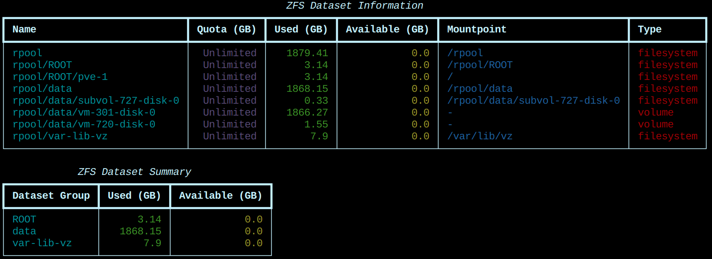

# cli_zfs-datasets-status
Get status information about your ZFS datasets

## Description
This Python script provides a user-friendly command-line interface to display status information about ZFS datasets. It presents the information in two tables:
1. A detailed table showing all ZFS datasets with their properties.
2. A summary table showing the main dataset groups (ROOT, data, var-lib-vz) with their usage and available space.

## Prerequisites
To run this script, you need:
- Python 3.6 or higher
- The `rich` library for formatted console output
- ZFS installed on your system

## Installation
1. Clone this repository:
   ```
   git clone https://github.com/yourusername/cli_zfs-datasets-status.git
   cd cli_zfs-datasets-status
   ```
2. Install the required Python library:
   ```
   pip install rich
   ```

## Usage
Run the script from the command line:
```
python zfs_status.py
```

## Output
The script will display two tables:
1. ZFS Dataset Information: A detailed view of all datasets.
2. ZFS Dataset Summary: A summary of the main dataset groups.
### Screenshot


## How it works
1. The script executes the ZFS command to get dataset information.
2. It parses the command output and organizes the data.
3. Using the `rich` library, it creates and displays formatted tables.
4. The summary table shows pre-summed values for the main dataset groups.

## Customization
You can modify the script to change the displayed information or adjust the formatting as needed. Feel free to fork this repository and make your own changes.

## Troubleshooting
If you encounter any issues:
1. Ensure you have the necessary permissions to execute ZFS commands.
2. Verify that the `rich` library is installed correctly.
3. Check if your Python version is 3.6 or higher.

## Contributing
Contributions are welcome! Please feel free to submit a Pull Request.

## License
This project is licensed under the MIT License. See the [LICENSE](LICENSE) file for details.

